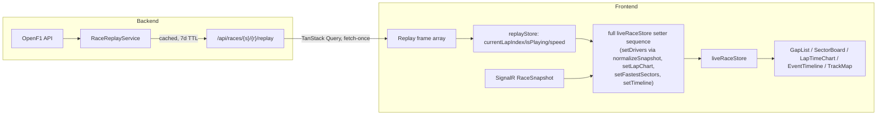

# Architecture Spine — F1_poc Phase 2 — UI/UX Improvement Pass

## Design Paradigm

Unchanged from phase-1: a **feature-based layered SPA** (React) talking to a **hosted-service backend** (ASP.NET Core) over REST + one SignalR hub. Phase 2 adds no new layer or paradigm — it adds two new subsystems inside the existing layering: a client-side **Race Replay** capability (live-race feature) and a **multi-card Fan Card** collection (fan-engagement feature), plus a season-wide expansion of the existing circuit-asset pipeline.

## Inherited Invariants

| Inherited | From parent | Binds here |
| --- | --- | --- |
| No backend database — `IMemoryCache` + `localStorage` only | phase-1 architecture.md | AD-2, AD-9 (new endpoint/keys still don't introduce a DB) |
| `DateTimeOffset` throughout C# backend, never `DateTime` | phase-1 architecture.md | AD-2 (`RaceReplayService`) |
| `ProblemDetails` (RFC 7807) error shape on all endpoints | phase-1 architecture.md | AD-2 (new replay endpoint) |
| `JsonNamingPolicy.CamelCase` global, no per-controller override | phase-1 architecture.md | AD-2, AD-11 |
| Feature-based frontend folders (`src/features/{feature}/`) | phase-1 architecture.md | All frontend ADs |
| TanStack Query = all server data; Zustand = UI-only state, never server data; one store per feature slice (`use{Feature}Store`) | phase-1 architecture.md | AD-3, AD-8 |
| `localStorage` key pattern `f1app__{feature}__{key}` for hand-rolled `useLocalStorage` usage (e.g. streak); **correction below** — Fan Card doesn't use this hook | phase-1 architecture.md | AD-9 |
| `*Service`/`*Client`/`*Dto` suffix conventions (backend, `*Dto` reserved for external-API-shape classes); route-level `ErrorBoundary` per feature (frontend) | phase-1 architecture.md | AD-2, AD-11 |
| Ergast/OpenF1 external-shape isolation: only `Clients/`+`Dtos/` (backend) and `shared/api/` (frontend) touch raw external shapes | phase-1 architecture.md | AD-2, AD-11 |

`[ADOPTED — reality check]` Phase-1's architecture doc describes localStorage versioning as one unified convention, but the shipped code actually has two separate mechanisms: the streak feature uses the hand-rolled `useLocalStorage` hook (key-name-embedded version), while Fan Card (`useFanCardStore.ts`) uses Zustand's `persist` middleware directly, which owns its own independent `version`+`migrate` mechanism. AD-9 below follows persist's mechanism, not the hook's, because that's what Fan Card actually uses.

## Invariants & Rules



### AD-1 — Replay reuses the live domain shape, across the store's full surface

- **Binds:** FR-5–FR-9; `GapList`, `SectorBoard`, `LapTimeChart`, `EventTimeline`, `TrackMap`; every `liveRaceStore` field
- **Prevents:** replay and live rendering diverging into two component trees or two data shapes. `[ADOPTED — reality check]` `liveRaceStore` holds seven fields fed by seven setters (`drivers`, `lapChart`, `fastestSectors`, `timeline`, `sessionMode`, `fallbackRaceName`, `circuitId`) — a rule that only mentions `drivers`/`normalizeSnapshot()` would leave `SectorBoard`, `LapTimeChart`, and `EventTimeline` stale during replay if a dev implements it literally.
- **Rule:** For each replay frame, the same sequence of `liveRaceStore` setters that the live SignalR path calls (`setDrivers` via `normalizeSnapshot()`, `setLapChart`, `setFastestSectors`, `setTimeline`) runs against that frame's data — replay does not get a partial update path. `setSessionMode('fallback')`, `setFallbackRaceName`, and `setCircuitId` are set once when replay mode is entered, not per-frame. Live-race components never branch on `isReplay` — they render whatever `liveRaceStore` holds, regardless of source.

### AD-2 — Replay data comes from a new bounded endpoint, not simulated live streaming

- **Binds:** FR-5, FR-6–FR-9
- **Prevents:** replay being wired through `RaceHub`/SignalR (a fake live session, contradicting the PRD's "no new live-data source" non-goal)
- **Rule:** Backend adds `GET /api/races/{season}/{round}/replay`, returning the full ordered array of per-lap `RaceStateSnapshot` frames. `RaceReplayService` assembles it from the same OpenF1 historical REST + Ergast sources as the existing fallback-to-last-race path (MVP FR-16). Cached via `IMemoryCache`, 7-day TTL (same tier as historical race results — immutable once the race completes). Frontend fetches the array once via TanStack Query; no per-lap network call.

### AD-3 — Replay state stays on the TanStack Query / Zustand boundary

- **Binds:** FR-6–FR-9; the inherited "Zustand never holds server data" rule
- **Prevents:** the fetched frame array being stuffed into Zustand, or playback position being re-fetched per lap
- **Rule:** The AD-2 frame array lives only in TanStack Query cache. A new `replayStore` (Zustand) holds only `currentLapIndex`, `isPlaying`, `speed` (`1|2|4`) and derives the displayed frame by indexing into the query's cached array. Scrub = direct index set, no re-fetch.

### AD-4 — Replay ticking is client-side only, and scrub never races the interval

- **Binds:** FR-6–FR-9
- **Prevents:** a second real-time channel (SignalR subscription or polling loop) duplicating `RaceDataOrchestrator`'s job for historical data. Also prevents a scrub-during-playback race: two devs could otherwise resolve "drag the scrub bar while playing" oppositely — one auto-pausing, one leaving the interval running — producing a visible glitch (index fighting itself) in only one implementation.
- **Rule:** Playback advances `currentLapIndex` via a client-side interval timer at `baseIntervalMs / speed`. Pause clears the timer. Scrub sets the index directly with no animation catch-up (snap-to-lap, per `EXPERIENCE.md`) and does **not** change `isPlaying` — if the interval was running before the scrub, it keeps running from the new index at the same cadence (matches `EXPERIENCE.md` Flow 2: scrub-then-immediately-continue-watching); if paused, it stays paused at the new index. The interval reads `currentLapIndex` fresh on each tick rather than closing over a stale value, so a scrub is always reflected on the next tick regardless of timing.

### AD-5 — Circuit outline extends the existing `circuit-configs` asset, not a second asset class

- **Binds:** FR-4, FR-13; existing `TrackMap.tsx` / `circuit-configs/` pattern
- **Prevents:** a parallel "decorative outline" asset pipeline coexisting with the live-map's `trackPath`+`transform` config — two sources of truth for one circuit's shape
- **Rule:** `circuit-configs/{circuitId}.json`'s existing `trackPath` field (already viewBox-scoped SVG path data) is the single source for every rendering of a circuit's shape: the calendar card (FR-4, small crop), Race Weekend Detail (FR-13, large crop), and the existing live-map overlay all consume the same file at different CSS sizes — no new fields, no second file per circuit. Coverage expands from 1 circuit (Monza, phase-1 POC scope) to the full current-season calendar, sourced from `f1db/f1db` (CC-BY-4.0) using each circuit's `-present` layout (e.g. `monza-7`, not `monza-1`).

### AD-6 — Circuit-config assets are fetched same-origin, never through the backend API base URL

- **Binds:** FR-4, FR-13, all `circuit-configs` consumers, including the existing `TrackMap.tsx`
- **Prevents:** production 404/CORS failure — frontend (Vercel) and backend (Render) are different origins, and `circuit-configs/*.json` physically lives in `frontend/public/`, not on the backend
- **Rule:** All `circuit-configs` fetches use a relative same-origin path — `fetch('/circuit-configs/{id}.json')` — never `${VITE_API_BASE_URL}`-prefixed. `[ADOPTED — reality check]` The current `TrackMap.tsx` fetches via `${apiBase}/circuit-configs/...`, and `apiBase` already resolves to the backend origin in both `.env.example` and `.env.local`; this is a pre-existing latent bug that phase-2's season-wide expansion makes load-bearing across every calendar card, not just the one live-map POC circuit. The fix applies to that existing call site too, not only new FR-4/FR-13 code.

### AD-7 — f1db attribution is sitewide, not per-instance

- **Binds:** FR-4, FR-13 (every track outline render)
- **Prevents:** N per-card/per-page attribution strings drifting or being forgotten on new surfaces
- **Rule:** One persistent app-level credit line (e.g. site footer: "Track outlines: f1db/f1db, CC-BY-4.0") satisfies the license. Individual outline components carry no attribution markup themselves.

### AD-8 — Championship Sidebar has no new data path

- **Binds:** FR-3
- **Prevents:** a second standings fetch/cache diverging from the Standings page's numbers (different `staleTime`, momentary mismatch)
- **Rule:** `ChampionshipSidebar` imports the same existing TanStack Query hook/key (the `queryKeys.ts` standings entry) already used by `StandingsPage`. No new backend endpoint, no new query key.

### AD-9 — Fan Card storage migrates via Zustand `persist`'s own versioning, not a key-name bump

- **Binds:** FR-12; the actual `useFanCardStore.ts` implementation (Zustand `persist` middleware, key `f1app__fanCard__v1`, currently holding a single `FanCardPicks` object)
- **Prevents:** multi-card support being bolted onto the existing single-object value (breaks "creating a card never overwrites an existing one"), or a migration that silently no-ops because it targets a key/mechanism the store doesn't actually use. `[ADOPTED — reality check]` An earlier draft of this AD assumed a `useLocalStorage`-hook-style migration from a `f1app__fanCard__v2` key — neither exists; the store uses `persist` directly, whose storage envelope and versioning are separate from the app's hand-rolled hook (see Inherited Invariants correction above). Following the wrong mechanism would have silently dropped every existing user's card.
- **Rule:** Persisted shape changes from a single `FanCardPicks` object to `{ cards: FanCardPicks[] }`, each entry tagged with a client-generated `id` (`crypto.randomUUID()`). Use `persist`'s own `version: 1` (bumped from the implicit `0`) and a `migrate(persistedState, version)` function that, when `version === 0`, wraps the old single-`FanCardPicks` state into `{ cards: [{ ...persistedState, id: crypto.randomUUID() }] }`. The storage key stays `f1app__fanCard__v1` — `persist` owns migration internally; no key rename. Store actions: `addCard` — never `setCard`/overwrite.

### AD-10 — Fan Card assets are manually curated; no new external API `[ASSUMPTION]`

- **Binds:** FR-11
- **Prevents:** a dev spiking a licensed photo API integration (cost/licensing risk) for a roster that's small and fixed (~20 drivers / 10 constructors)
- **Rule:** Driver photos are hand-curated static assets (`frontend/public/fan-card-assets/drivers/{driverId}.jpg`). Team-principal names live in a hand-maintained static config (`frontend/src/shared/data/teamPrincipals.ts`), alongside where team colors/branding are already hand-maintained. Autograph is a stylized signature-style font rendering of the driver's name — not a scanned/licensed real signature — sidestepping signature-rights sourcing entirely. A missing driver asset (mid-season roster change) falls back to an initials placeholder, per the app's existing no-broken-image-state pattern; it never blocks card creation.

### AD-11 — News preview reuses the existing feed-parsing pipeline; no new fetch

- **Binds:** FR-18; the "no new external data source" non-goal
- **Prevents:** a dev adding a second network hop (e.g. scraping each article's page for an OpenGraph image)
- **Rule:** `NewsFeedService` (`CodeHollow.FeedReader`) extracts `imageUrl` (from the item's enclosure, if present) and `snippet` (from the item's `Description`, truncated) at parse time. The existing internal model, `Models/NewsItem.cs`, gains these two optional fields `[ADOPTED — reality check: the real type is `Models/NewsItem.cs`, not a `Dtos/` class — there is no intermediate DTO for news; `Dtos/` stays reserved for Ergast/OpenF1 external-shape isolation per the Inherited Invariants table, so this addition does not introduce a competing news-item type]`. Missing values degrade to title-only per FR-18's stated consequence — a per-item null, not an error.

### AD-12 — Accessibility AA is an automated CI gate, not a manual checklist

- **Binds:** PRD §7 Accessibility NFR, SM-2
- **Prevents:** WCAG AA regressing silently — the PRD's success metric names a Lighthouse/axe threshold, but phase-1 had no automated a11y check in CI
- **Rule:** Add `@axe-core/playwright` assertions to the existing Playwright E2E suite (`playwright/`), run against the five pages SM-2 names (Calendar, Live Race, Standings, Fan Card, Race Weekend Detail), wired into the existing CI pipeline rather than a separate manual audit step.

### AD-13 — First modal/overlay primitive is a shared, hand-built component

- **Binds:** FR-10 (Fan Card creation prompt); DESIGN.md's inherited "fully hand-built components, no headless library" rule; any future modal usage
- **Prevents:** `[ADOPTED — reality check]` `EXPERIENCE.md` describes FR-10 as reusing an "existing one-level-deep overlay pattern," but no modal/dialog/portal component exists anywhere in the current codebase — `FanCardWizard` currently renders inline inside `FanCardPage`, not as an overlay. Left unaddressed, two devs would each hand-roll a one-off modal for FR-10 with no shared accessibility contract (focus trap, Escape close, focus return, `aria-modal`), directly undermining the WCAG AA gate (AD-12).
- **Rule:** Add one shared `Modal` primitive to `frontend/src/shared/components/` — portal-rendered, traps focus, closes on `Escape` and backdrop click, returns focus to the trigger element on close, `role="dialog"` `aria-modal="true"`. FR-10's Fan Card prompt is the first consumer: `StandingsPage` renders the prompt via `Modal`, with `FanCardWizard` mounted inside it. This is the only sanctioned overlay mechanism going forward — no ad hoc fixed-position divs for modal-like UI.

## Consistency Conventions

| Concern | Convention |
| --- | --- |
| Naming | `replayStore` follows inherited `use{Feature}Store` pattern → `useReplayStore`. New endpoint follows inherited kebab-case plural convention → `/api/races/{season}/{round}/replay`. New model fields follow the inherited camelCase JSON policy; `*Dto` suffix reserved for external-shape classes only (AD-11 correction). |
| Data & formats | Replay frames are `RaceStateSnapshot`/`DriverState` — no new payload shape. Fan Card storage is `{ cards: FanCardPicks[] }` with a client-generated `id` per card (AD-9). |
| State & cross-cutting | Server data (replay frame array, standings, news) → TanStack Query, always. UI-only interaction state (replay position/speed, sidebar collapse) → Zustand, always. Circuit assets fetched relative/same-origin, never via `VITE_API_BASE_URL`. All modal-like UI goes through the shared `Modal` primitive (AD-13). |

## Stack

No stack changes. One addition:

| Name | Version |
| --- | --- |
| `@axe-core/playwright` | ^4.10 (verify current at implementation time) |

All other stack entries inherited unchanged from phase-1 architecture.md (React 19, Vite, TanStack Query v5, Zustand, React Router v7, `@microsoft/signalr`, Tailwind v4, `html-to-image`, `zod`, ASP.NET Core 10, `CodeHollow.FeedReader`, `IMemoryCache`, `xunit`/`Moq`, `WireMock.Net`).

## Structural Seed

```text
frontend/src/features/live-race/
  store/
    liveRaceStore.ts       # unchanged
    replayStore.ts         # NEW — AD-3/AD-4: currentLapIndex, isPlaying, speed
  ReplayBar/
    ReplayBar.tsx           # NEW — FR-6-FR-9 controls
    useRaceReplayQuery.ts   # NEW — TanStack Query wrapper for AD-2 endpoint

frontend/src/features/calendar/
  ChampionshipSidebar.tsx   # NEW — FR-3, AD-8 (reuses standings query)
  TrackOutline.tsx          # NEW — FR-4, shared with Race Weekend Detail (AD-5)

frontend/src/features/fan-engagement/
  useFanCardStore.ts        # MODIFIED — AD-9: FanCardPicks -> { cards: FanCardPicks[] }, persist version 1 + migrate
  FanCardGrid.tsx            # NEW — FR-12 multi-card grid

frontend/src/shared/components/
  Modal.tsx                  # NEW — AD-13: shared portal/focus-trap primitive, first consumer is FR-10

frontend/public/
  circuit-configs/           # EXPANDED — AD-5: 1 circuit -> full season, f1db-sourced trackPath
  fan-card-assets/drivers/    # NEW — AD-10: hand-curated driver photos

frontend/src/shared/data/
  teamPrincipals.ts           # NEW — AD-10: hand-maintained static config

backend/F1App.Api/
  Controllers/
    RacesController.cs        # MODIFIED — add replay action (AD-2)
  Services/
    RaceReplayService.cs       # NEW — AD-2: assembles historical frame array
  Models/
    NewsItem.cs                # MODIFIED — AD-11: + imageUrl, + snippet
```

## Capability → Architecture Map

| Capability / Area | Lives in | Governed by |
| --- | --- | --- |
| FR-1, FR-2 (upcoming-focused view, filter) | `CalendarPage.tsx` | Inherited conventions only — presentation/filter state, no new AD |
| FR-3 (Championship Sidebar) | `ChampionshipSidebar.tsx` | AD-8 |
| FR-4 (redesigned race card + outline) | `RaceWeekendCard.tsx`, `TrackOutline.tsx` | AD-5, AD-6, AD-7 |
| FR-5–FR-9 (Race Replay) | `live-race/ReplayBar/`, `replayStore.ts`, `RaceReplayService.cs` | AD-1, AD-2, AD-3, AD-4 |
| FR-10 (Fan Card prompt) | `StandingsPage.tsx` + `shared/components/Modal.tsx` | AD-13 — deferred suppression window (see Deferred) |
| FR-11 (Fan Card visual redesign) | `FanCard.tsx`, `fan-card-assets/`, `teamPrincipals.ts` | AD-10 |
| FR-12 (multi-card) | `useFanCardStore.ts`, `FanCardGrid.tsx` | AD-9 |
| FR-13–FR-15 (track layout, records, history) | `RaceWeekendDetailView.tsx` | AD-5, AD-6, AD-7 (outline); inherited Circuit Profile data (no new AD) |
| FR-16 (win prediction) | `RaceWeekendDetailView.tsx` | Inherited `WinProbabilityService` — presentation-only wrapper, no new AD |
| FR-17 (grouped profile stats) | `DriverProfilePage.tsx` et al. | Presentation-only, no new AD |
| FR-18 (news preview) | `NewsFeedService.cs`, `Models/NewsItem.cs`, `NewsFeedPage.tsx` | AD-11 |

## Deferred

- **Fan Card prompt suppression window (FR-10):** a dismissal-duration constant, not a structural decision — two devs choosing different N doesn't create incompatibility. Revisit at story-write time.
- **Championship Sidebar third slot (FR-3 Notes / PRD Open Question 5):** left open by product/UX. No structural provision needed beyond the sidebar component accepting an optional third child region. Revisit if/when product decides.
- **Rollout sequencing (PRD Open Question 6):** a sprint-planning concern — every FR in this spine ships independently per-page, so either sequencing works without spine changes. Revisit in `bmad-create-epics-and-stories` / `bmad-sprint-planning`.
- **Race Weekend Detail field-removal audit (PRD Open Question 1):** a content/PM decision (which existing fields to cut), not structural. Revisit before FR-13–16 stories are written.
- **Deployment & environments:** unchanged from phase-1 (Vercel frontend + Render backend, no docker-compose, CORS locked to configured origin). Phase 2 adds one new backend endpoint (AD-2) and no new services/infra — confirmed inherited as-is, not a silent gap.
- **React Router v8** shipped June 2026, after phase-1 pinned v7 (mostly non-breaking; drops the `react-router-dom` package name in favor of `react-router`/`react-router/dom`). Not a phase-2 decision — this spine doesn't touch routing — but worth a heads-up for whoever picks up the first phase-2 story that touches `router.tsx`.
